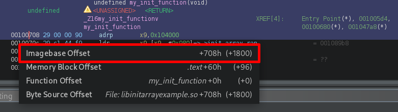
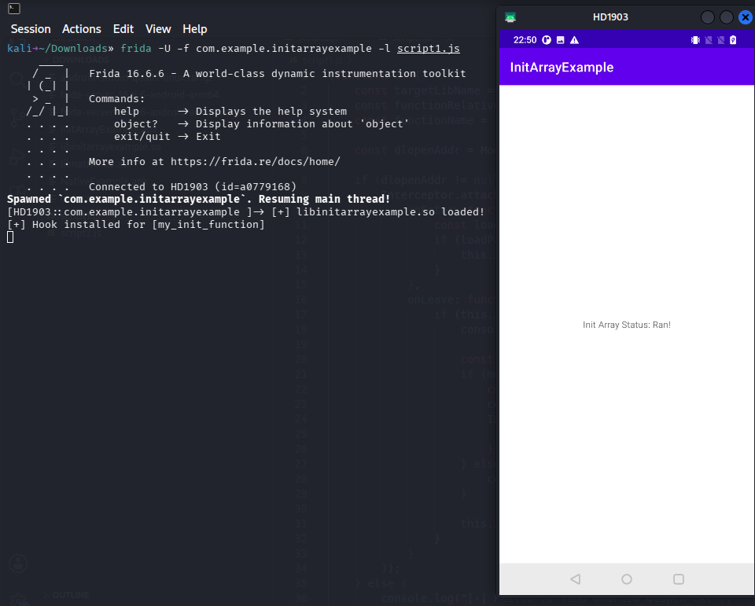
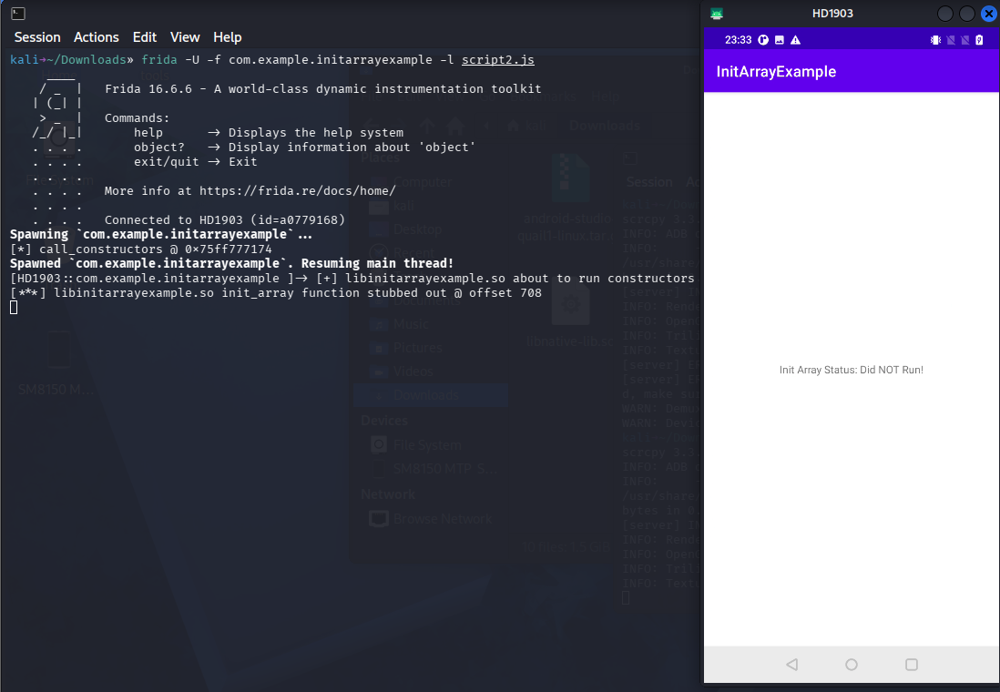

Many advanced Android apps hide their anti-tampering and anti-analysis checks
inside the `.init_array`. If you try to attach Frida normally, these checks run
and kill the app before your script even loads.

Here is how to deal with them.

### What is `.init_array`?

Simply put: `.init_array` is a section inside an ELF binary (`.so` file) that
contains an array of function pointers.

The Android dynamic linker executes these functions **extremely early**—right
when `System.loadLibrary()` is called, and long before `JNI_OnLoad` fires.
Because it executes so early in the native lifecycle, it's a prime spot for
developers to hide early anti-tampering mechanisms.

### The Target App

To demonstrate, I built an example APK that triggers a native function inside
`.init_array` to toggle a boolean flag.

You can find the source code [here](https://github.com/Avev/InitArrayExample)
and you can download the `apk` file from the repository's
[releases](https://github.com/Avev/InitArrayExample/releases/tag/v1.0.0).

### Example Code

Let's look at the example's code.

#### initarrayexample.cpp

This is the native library's code.

```c
#include <jni.h>

// Simple global flag initialized to false
bool init_array_ran = false;

__attribute__((constructor)) void my_init_function() {
    init_array_ran = true;
}

extern "C" JNIEXPORT jboolean JNICALL
Java_com_example_initarrayexample_MainActivity_checkInitStatus(JNIEnv* env, jobject thiz) {
    return init_array_ran;
}
```

The code has two functions: `my_init_function`, which sets a flag to true, and
`checkInitStatus`, which returns the flag so the Java layer can check it.

#### MainActivity.java

```java
package com.example.initarrayexample;

import androidx.appcompat.app.AppCompatActivity;
import android.os.Bundle;
import android.widget.TextView;
import com.example.initarrayexample.databinding.ActivityMainBinding;

public class MainActivity extends AppCompatActivity {

    static {
        System.loadLibrary("initarrayexample");
    }

    private ActivityMainBinding binding;

    @Override
    protected void onCreate(Bundle savedInstanceState) {
        super.onCreate(savedInstanceState);

        binding = ActivityMainBinding.inflate(getLayoutInflater());
        setContentView(binding.getRoot());

        TextView tv = binding.sampleText;

        if (checkInitStatus()) {
            tv.setText("Init Array Status: Ran!");
        } else {
            tv.setText("Init Array Status: Did NOT Run!");
        }
    }

    public native boolean checkInitStatus();
}
```

The code loads the native library `initarrayexample`, calls the native function
`checkInitStatus`, and displays on screen whether the `.init_array` function ran.

### The Goal

We want to prevent `my_init_function` from changing the flag. We'll do that by
hooking it and replacing its behavior using Frida.

### A Note on Running These Scripts

Both scripts must be run in **spawn mode**, not attached to a running process.
By the time you attach to a running app, `System.loadLibrary()` has already
been called and the `.init_array` functions have already executed. Use:

```bash
frida -U -f com.example.initarrayexample -l script.js
```

The `-f` flag tells Frida to spawn the app itself, giving your script a chance
to set up hooks before any native libraries load.

### First Attempt

Now we'll decompile the APK and native library using jadx and Ghidra, find the
function's offset, and hook it using a generic native hook.

If you want to learn more about setup, Java, and native hooking, I recommend
noobexon1's [blog](https://noobexon1.github.io/).

First, let's check the function's offset using Ghidra:



Now let's hook it using Frida with a generic native hook, replacing the
function's behavior with an immediate return.

#### script1.js

```javascript
(function () {
    const targetLibName = "libinitarrayexample.so";
    const functionRelativeAddress = 0x708;
    const functionName = "my_init_function";

    const dlopenAddr = Module.findExportByName(null, "android_dlopen_ext");

    if (dlopenAddr != null) {
        Interceptor.attach(dlopenAddr, {
            onEnter: function (args) {
                const loadPath = args[0].readCString();
                if (loadPath != null && loadPath.includes(targetLibName)) {
                    this.isTarget = true;
                }
            },
            onLeave: function () {
                if (this.isTarget) {
                    console.log(`[+] ${targetLibName} loaded!`);

                    const module = Process.findModuleByName(targetLibName);
                    if (module != null) {
                        const targetAddr = module.base.add(functionRelativeAddress);
                        console.log(`[+] Hook installed for [${functionName}]`);
                        Interceptor.replace(targetAddr, new NativeCallback(function () {
                            console.log(`[***] ${functionName} stubbed out @ offset 0x${functionRelativeAddress.toString(16)}`);
                        }, 'void', []));
                    } else {
                        console.log("[!] Failed to find module");
                    }

                    this.isTarget = false;
                }
            }
        });
    } else {
        console.log("[-] Failed to find android_dlopen_ext");
    }
})();
```



Frida did manage to hook the function, but the flag was still changed. Why?
The answer is **timing**.

`android_dlopen_ext` is the function the Android runtime calls internally when
your app calls `System.loadLibrary()`. We hook its `onLeave` — meaning our hook
code runs after `dlopen` returns. But the linker runs `.init_array` functions
**synchronously, inside `dlopen`**, before it ever returns. So by the time
`onLeave` fires, `my_init_function` has already executed and the flag is already
set. We're always one step behind.

To get ahead of it, we need to hook deeper — into the linker itself, before it
calls the constructors.

### Second Attempt

Instead of hooking `android_dlopen_ext`, we'll hook the linker's internal
`call_constructors` function, which is called synchronously during library
loading right before `.init_array` functions execute. This gives us a window to
replace `my_init_function` before it runs.

#### script2.js

```javascript
const TARGET_LIB = "libinitarrayexample.so";
const TARGET_OFFSET = 0x708;

function hookInitArrayFunction() {
  const linker = Process.findModuleByName("linker64");
  if (!linker) {
    console.error("[!] linker64 not found");
    return;
  }

  const sym = linker.enumerateSymbols().find(s =>
    s.name === "__dl__ZN6soinfo17call_constructorsEv"
  );
  if (!sym) {
    console.error("[!] call_constructors not found");
    return;
  }

  console.log(`[*] call_constructors @ ${sym.address}`);

  let isHooked = false;
  Interceptor.attach(sym.address, {
    onEnter(args) {
      if (isHooked) return;
      // args[0] is a pointer to the soinfo struct for the library being loaded.
      // At offset 0x10 inside soinfo sits a pointer to the library's load address,
      // which we use to locate the module.
      const moduleBase = args[0].add(0x10).readPointer();
      const mod = Process.findModuleByAddress(moduleBase);
      if (!mod?.name.includes(TARGET_LIB)) return;

      console.log(`[+] ${mod.name} about to run constructors`);
      isHooked = true;

      const targetFunc = moduleBase.add(TARGET_OFFSET);
      Interceptor.replace(targetFunc, new NativeCallback(function () {
        console.log(`[***] ${TARGET_LIB} init_array function stubbed out @ offset 0x${TARGET_OFFSET.toString(16)}`);
      }, 'void', []));
    },
  });
}

hookInitArrayFunction();
```

> **Note on C++ name mangling:** The linker is compiled as C++, so
> `call_constructors` is exported under its mangled name
> `__dl__ZN6soinfo17call_constructorsEv`. It also has helper lambdas whose
> names contain the substring `call_constructors`, such as
> `__dl__ZZN6soinfo17call_constructorsEvENK3$_0`. We match on the exact mangled
> name to avoid accidentally hooking one of those helpers.

Now let's run it:



This time it worked — we hooked the function early enough to prevent it from
changing the flag.

### Template

Here is a ready-to-use template for hooking any `.init_array` function:

#### template.js

```javascript
// == CONFIGURE THESE ==
const TARGET_LIB = "lib<name>.so";  // TODO: target library name
const TARGET_OFFSET = 0x0;          // TODO: offset of the .init_array function from the library base
// =====================

let hooked = false;

function hookInitArrayFunction() {
  const linker = Process.findModuleByName("linker64");
  if (!linker) {
    console.error("[!] linker64 not found");
    return;
  }

  const sym = linker.enumerateSymbols().find(s =>
    s.name === "__dl__ZN6soinfo17call_constructorsEv"
  );
  if (!sym) {
    console.error("[!] call_constructors not found");
    return;
  }

  console.log(`[*] call_constructors @ ${sym.address}`);

  Interceptor.attach(sym.address, {
    onEnter(args) {
      if (hooked) return;

      // args[0] is a pointer to the soinfo struct for the library being loaded.
      // At offset 0x10 inside soinfo sits a pointer to the library's load address.
      const moduleBase = args[0].add(0x10).readPointer();
      const mod = Process.findModuleByAddress(moduleBase);
      if (!mod?.name.includes(TARGET_LIB)) return;

      console.log(`[+] ${mod.name} about to run constructors — installing hook`);
      hooked = true;

      const targetFunc = moduleBase.add(TARGET_OFFSET);
      Interceptor.replace(targetFunc, new NativeCallback(function () {
        console.log(`[***] ${TARGET_LIB} init_array function stubbed out @ offset 0x${TARGET_OFFSET.toString(16)}`);
      }, 'void', []));
    },
  });
}

hookInitArrayFunction();
```

Run it in spawn mode:

```bash
frida -U -f com.example.yourapp -l template.js
```
